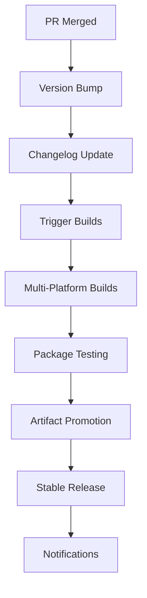

# GitHub Copilot Instructions for omnibus-toolchain

This comprehensive guide provides GitHub Copilot with detailed instructions for working with the omnibus-toolchain repository, which creates native platform packages containing the entire required toolchain for building Omnibus projects by Chef Software, Inc.

## Table of Contents

- [Repository Analysis & Structure](#repository-analysis--structure)
- [Development Workflow Integration](#development-workflow-integration)
- [Testing Requirements](#testing-requirements)
- [Pull Request Creation Process](#pull-request-creation-process)
- [DCO (Developer Certificate of Origin) Compliance](#dco-developer-certificate-of-origin-compliance)
- [Build System Integration Analysis](#build-system-integration-analysis)
- [Label Management System](#label-management-system)
- [Prompt-Based Execution Protocol](#prompt-based-execution-protocol)
- [Repository-Specific Guidelines](#repository-specific-guidelines)
- [Code Quality & Standards](#code-quality--standards)
- [Security and Compliance Requirements](#security-and-compliance-requirements)
- [Build & Development Environment](#build--development-environment)
- [Integration & Dependencies](#integration--dependencies)
- [Release & CI/CD Awareness](#release--cicd-awareness)
- [Code Ownership & Review Process](#code-ownership--review-process)
- [Technology-Specific Guidelines](#technology-specific-guidelines)
- [Example Workflow Execution](#example-workflow-execution)

## Repository Analysis & Structure

### Project Overview
The omnibus-toolchain is an **umbrella project** under Chef Foundation that creates native platform packages containing the complete toolchain required for building Omnibus projects. It supports multiple operating systems including Solaris, AIX, various Linux distributions, macOS, FreeBSD, and Windows.

### Repository Structure Diagram
```
omnibus-toolchain/
├── .expeditor/                    # Build automation configuration
│   ├── config.yml                # Main Expeditor configuration
│   ├── release.omnibus.yml        # Release pipeline configuration
│   ├── adhoc-canary.omnibus.yml   # Canary testing pipeline
│   └── verify.pipeline.yml        # PR validation pipeline
├── .github/                       # GitHub-specific configurations
│   ├── CODEOWNERS                # Code ownership definitions
│   ├── ISSUE_TEMPLATE/            # Issue templates
│   └── dependabot.yml            # Dependency management
├── config/                        # Omnibus project and software definitions
│   ├── projects/                  # Project definitions
│   │   ├── omnibus-toolchain.rb   # Main toolchain project
│   │   └── angry-omnibus-toolchain.rb # Self-build variant
│   └── software/                  # Software component definitions
│       ├── cmake.rb               # CMake build tool
│       ├── gtar.rb                # GNU tar utility
│       ├── helper-gems.rb         # Ruby gems collection
│       └── omnibus-toolchain.rb   # Main toolchain software
├── docs/                          # Platform-specific documentation
│   ├── Debian_Ubuntu_Linux.md     # Debian/Ubuntu build instructions
│   ├── RHEL_CentOS_Fedora.md     # Red Hat family build instructions
│   └── solaris_toolchain_base.md  # Solaris build instructions
├── package-scripts/               # Post-install/remove scripts
│   ├── omnibus-toolchain/         # Main package scripts
│   └── angry-omnibus-toolchain/   # Self-build package scripts
├── resources/                     # Static resources
│   └── omnibus-toolchain/         # Package-specific resources
│       ├── ips/                   # Solaris IPS templates
│       ├── msi/                   # Windows MSI resources
│       └── pkg/                   # macOS package resources
├── scripts/                       # Build and verification scripts
│   └── verify.sh                  # Post-build verification script
├── kitchen*.yml                   # Test Kitchen configurations
├── omnibus.rb                     # Omnibus build configuration
├── omnibus-test.sh               # Linux/macOS test script
├── omnibus-test.ps1              # Windows test script
├── Gemfile                       # Ruby dependencies
├── Rakefile                      # Ruby build tasks
└── VERSION                       # Version information
```

### Programming Languages & Technologies
- **Primary Language**: Ruby (Omnibus framework, DSL definitions)
- **Build System**: Omnibus (package creation framework)
- **Testing**: Test Kitchen (infrastructure testing)
- **Automation**: Expeditor (CI/CD automation)
- **Package Management**: Bundler (Ruby), native package managers
- **Supported Platforms**: 
  - Unix-like: Solaris 11.3/11.4, AIX 7.1/7.2, various Linux distributions, macOS 10.15+, FreeBSD 11/12
  - Windows: 2012R2-2022, Windows 8-11

### File Modification Guidelines

#### ✅ **Safe to Modify**
- `config/software/*.rb` - Software component definitions
- `docs/*.md` - Documentation files
- `package-scripts/` - Post-install/remove scripts
- `resources/omnibus-toolchain/` - Package resources and templates
- `scripts/verify.sh` - Verification scripts
- `kitchen*.yml` - Test Kitchen configurations (with caution)

#### ⚠️ **Modify with Extreme Caution**
- `config/projects/*.rb` - Project definitions (affects package structure)
- `omnibus.rb` - Core build configuration
- `.expeditor/config.yml` - CI/CD pipeline configuration
- `Gemfile` - Dependency changes can break builds

#### 🚫 **NEVER MODIFY**
- `VERSION` - Managed by Expeditor automation
- `CHANGELOG.md` - Auto-generated by Expeditor
- `.expeditor/*.yml` - Build pipeline definitions (unless explicitly required)
- `Gemfile.lock` - Auto-generated dependency lock file

#### 🔄 **Auto-Generated Files**
- `pkg/` directory - Contains generated packages
- Build artifacts and cache directories
- Expeditor-managed version and changelog files

## Development Workflow Integration

### Jira Integration Setup
When working with Jira tickets, use the atlassian-mcp-server MCP server to:
1. Fetch issue details using the Jira ID
2. Read and understand the story requirements
3. Implement the requested changes
4. Link implementation back to the Jira ticket

### Workflow Phases

#### Phase 1: Initial Setup & Analysis
**Prompt**: "Let's start Phase 1: Initial Setup & Analysis. I'll analyze the Jira ticket and repository structure."

**Actions**:
1. **Jira Analysis**: Fetch and analyze the Jira ticket details
2. **Repository Analysis**: Review current codebase structure
3. **Implementation Planning**: Create detailed implementation plan
4. **Impact Assessment**: Identify affected components and dependencies

**Deliverables**:
- Jira ticket summary and requirements
- Implementation strategy document
- List of files to be modified
- Testing strategy outline

**Gate**: Wait for user approval: "Do you want me to continue with Phase 2: Implementation?"

#### Phase 2: Implementation Phase
**Prompt**: "Starting Phase 2: Implementation. I'll implement the changes according to the approved plan."

**Actions**:
1. **Code Implementation**: Make the planned changes
2. **Documentation Updates**: Update relevant documentation
3. **Configuration Updates**: Modify build configurations if needed
4. **Resource Updates**: Update package resources and scripts

**Deliverables**:
- Implemented code changes
- Updated documentation
- Modified configuration files
- Updated package resources

**Gate**: Wait for user approval: "Do you want me to continue with Phase 3: Testing?"

#### Phase 3: Testing Phase (CRITICAL)
**Prompt**: "Starting Phase 3: Testing. I'll create comprehensive tests with >80% coverage requirement."

**⚠️ CRITICAL REQUIREMENT**: **>80% TEST COVERAGE IS MANDATORY AND NON-NEGOTIABLE**

**Actions**:
1. **Test Creation**: Create comprehensive unit tests
2. **Coverage Verification**: Ensure >80% test coverage
3. **Integration Testing**: Run Test Kitchen validation
4. **Edge Case Testing**: Test error conditions and edge cases
5. **Platform Testing**: Verify cross-platform compatibility

**Testing Commands**:
```bash
# Ruby testing with RSpec (if tests exist)
bundle exec rspec --format documentation

# ChefStyle linting
bundle exec rake chefstyle

# Test Kitchen validation
kitchen test
kitchen verify

# Coverage reporting (if SimpleCov configured)
bundle exec rspec --format html --out coverage/index.html
```

**Deliverables**:
- Comprehensive test suite with >80% coverage
- Test execution results
- Coverage reports
- Integration test results

**Gate**: Wait for user approval: "Do you want me to continue with Phase 4: Pull Request Creation?"

#### Phase 4: Pull Request Creation
**Prompt**: "Starting Phase 4: Pull Request Creation. I'll create the PR with proper documentation."

**Actions**:
1. **Git Operations**: Branch creation, commits with DCO signoff
2. **PR Creation**: Create pull request with comprehensive description
3. **Documentation**: Include all required PR information
4. **Label Assignment**: Apply appropriate repository labels

## Testing Requirements (CRITICAL - Hard Requirement)

### 🚨 **MANDATORY >80% TEST COVERAGE**
- **ALL implementations MUST have comprehensive unit tests**
- **>80% test coverage is a HARD, NON-NEGOTIABLE requirement**
- **Tests must be created for every new feature, bug fix, or modification**
- **Coverage verification is mandatory before PR creation**

### Testing Framework Guidelines

#### Ruby Testing (Primary)
- **Framework**: RSpec (preferred) or Minitest
- **Coverage**: SimpleCov for coverage reporting
- **Style**: ChefStyle for Ruby code style

```ruby
# Example RSpec test structure
require 'spec_helper'

RSpec.describe 'Omnibus::Toolchain' do
  describe '#build_component' do
    context 'when valid parameters provided' do
      it 'successfully builds the component' do
        # Test implementation
      end
    end

    context 'when invalid parameters provided' do
      it 'raises appropriate error' do
        # Error condition testing
      end
    end
  end
end
```

#### Test Kitchen Integration Testing
```bash
# Run all platform tests
kitchen test

# Test specific platform
kitchen test ubuntu-1804

# Verify build artifacts
kitchen verify

# Clean up test instances
kitchen destroy
```

### Coverage Requirements
- **Unit Tests**: >80% line coverage mandatory
- **Integration Tests**: Test Kitchen validation required
- **Edge Cases**: Error conditions and boundary testing
- **Mock External Dependencies**: Use proper mocking for external services
- **Independent Tests**: Tests must run in any order
- **Platform Coverage**: Test on multiple supported platforms

### Testing Commands
```bash
# Install dependencies
bundle install

# Run ChefStyle checks
bundle exec rake chefstyle

# Run unit tests (when implemented)
bundle exec rspec

# Generate coverage report
open coverage/index.html

# Integration testing
kitchen test
```

## Pull Request Creation Process

### Branch Naming Convention
- **Use Jira ID as branch name**: `PROJ-123` or `CHEF-12345`
- **Format**: `<JIRA_ID>` (e.g., `CHEF-26062`)

### Git Workflow Commands

#### 1. Branch Creation and Checkout
```bash
git checkout -b <JIRA_ID>
```

#### 2. Staging and Committing with DCO Signoff
```bash
# Stage all changes
git add .

# Commit with DCO signoff (REQUIRED)
git commit --signoff -m "<JIRA_ID>: Brief description of changes"
```

#### 3. Pushing to Remote
```bash
git push origin <JIRA_ID>
```

#### 4. Creating PR with GH CLI
```bash
# Create PR with labels and proper formatting
gh pr create \
  --title "<JIRA_ID>: Descriptive title" \
  --body-file pr_description.md \
  --label "enhancement" \
  --label "Expeditor: Skip All"
```

### PR Description Template (HTML Format)
```html
## Summary
<p>Brief summary of changes made in this pull request.</p>

## Jira Ticket
<p><a href="https://jira.example.com/browse/<JIRA_ID>">🎫 <JIRA_ID>: Ticket Title</a></p>

## Changes Made
<ul>
<li>✅ Change 1: Description</li>
<li>✅ Change 2: Description</li>
<li>✅ Change 3: Description</li>
</ul>

## Testing Performed
<ul>
<li>🧪 Unit tests created with >80% coverage</li>
<li>🔍 ChefStyle validation passed</li>
<li>🏗️ Test Kitchen validation completed</li>
<li>📊 Coverage report: <strong>XX%</strong></li>
</ul>

## Files Modified
<ul>
<li><code>config/software/example.rb</code> - Software definition updates</li>
<li><code>docs/example.md</code> - Documentation updates</li>
<li><code>spec/example_spec.rb</code> - New test coverage</li>
</ul>

## Coverage Results
<pre>
Coverage Report:
- Lines: XX/XX (XX.X%)
- Methods: XX/XX (XX.X%)
- Classes: XX/XX (XX.X%)
</pre>

## Screenshots/Examples
<p><em>Include screenshots or examples if applicable</em></p>
```

## DCO (Developer Certificate of Origin) Compliance

### 🚨 **CRITICAL DCO REQUIREMENTS**
- **ALL commits MUST use `git commit --signoff` or `git commit -s`**
- **Builds will fail without proper DCO signoff**
- **DCO signoff certifies compliance with Apache 2.0 license**

### Required Commands
```bash
# Commit with DCO signoff (ALWAYS use this)
git commit --signoff -m "JIRA-123: Your commit message"

# Short form
git commit -s -m "JIRA-123: Your commit message"

# Amend previous commit to add DCO signoff
git commit --amend --signoff --no-edit

# Check if commit has DCO signoff
git log --format=fuller
```

### DCO Signoff Format
Each commit must include:
```
Signed-off-by: Your Name <your.email@example.com>
```

### What DCO Certifies
By signing off, you certify that:
1. The contribution was created in whole or in part by you
2. You have the right to submit it under the Apache 2.0 license
3. You understand and agree the contribution is public

## Build System Integration Analysis

### Expeditor Configuration
Expeditor is the primary CI/CD automation system for this repository.

#### Available Skip Labels
```yaml
# Use these labels to control build behavior:
- "Expeditor: Skip All"           # Skip all Expeditor actions
- "Expeditor: Skip Version Bump"  # Skip version increment
- "Expeditor: Skip Changelog"     # Skip changelog update
- "Expeditor: Skip Omnibus"       # Skip Omnibus build
```

#### Build Channels and Pipelines
```yaml
Pipelines:
- verify: Pull Request validation tests
- omnibus/release: Production release builds
- omnibus/adhoc: Ad-hoc testing builds
- omnibus/angry-release: Self-build toolchain variant
- omnibus/adhoc-canary: Canary testing pipeline
```

#### When to Use Skip Labels
- **Documentation changes**: Use `"Expeditor: Skip All"`
- **Test-only changes**: Use `"Expeditor: Skip Version Bump"`
- **Configuration updates**: Use `"Expeditor: Skip Changelog"`
- **Development iterations**: Use `"Expeditor: Skip Omnibus"`

### Build Commands Available
```bash
# Bundle install
bundle install --without development

# Build the toolchain
bundle exec omnibus build omnibus-toolchain

# Clean build artifacts
bundle exec omnibus clean omnibus-toolchain

# Purge all build files (including cache)
bundle exec omnibus clean omnibus-toolchain --purge

# Get Omnibus help
bundle exec omnibus help

# Run ChefStyle
bundle exec rake chefstyle
```

### Release Process
1. **Version Management**: Automated by Expeditor
2. **Changelog**: Auto-generated from PR titles
3. **Package Building**: Multi-platform Omnibus builds
4. **Artifact Promotion**: Automatic promotion through channels
5. **Notification**: Slack notifications to `#chef-found-notify`

## Label Management System

### Repository-Specific Labels
Since GH CLI authentication is not available, use these common labels:

#### Change Type Labels
- `enhancement` - New features or improvements
- `bug` - Bug fixes
- `documentation` - Documentation updates
- `maintenance` - Maintenance and refactoring

#### Expeditor Control Labels
- `Expeditor: Skip All` - Skip all automation
- `Expeditor: Skip Version Bump` - Don't increment version
- `Expeditor: Skip Changelog` - Don't update changelog
- `Expeditor: Skip Omnibus` - Don't trigger builds
- `Expeditor: Bump Version Minor` - Force minor version bump
- `Expeditor: Bump Version Major` - Force major version bump

#### Priority Labels
- `priority: high` - High priority issues
- `priority: medium` - Medium priority issues
- `priority: low` - Low priority issues

### Label Selection Decision Matrix
| Change Type | Primary Label | Expeditor Label | Reason |
|-------------|---------------|-----------------|---------|
| Documentation only | `documentation` | `Expeditor: Skip All` | No build needed |
| Bug fixes | `bug` | None | Trigger normal build |
| New features | `enhancement` | None | Trigger normal build |
| Test additions | `enhancement` | `Expeditor: Skip Version Bump` | Tests don't need version bump |
| Config changes | `maintenance` | `Expeditor: Skip Changelog` | Internal changes |
| Dependencies | `maintenance` | None | May affect functionality |

## Prompt-Based Execution Protocol

### Execution Requirements
- **ALL tasks must be executed in a prompt-based manner**
- **After each major step**: Provide summary of completed work
- **Before next step**: Clearly state what the next step will be
- **Ask for confirmation**: "Do you want me to continue with the next step?"
- **List remaining steps**: Show what steps are still left to complete
- **Wait for approval**: Do not proceed until user confirms

### Example Interaction Pattern

#### Step 1: Analysis Phase
```
Assistant: I've completed the initial analysis phase:

✅ Completed:
- Analyzed Jira ticket CHEF-12345
- Reviewed repository structure
- Identified files to modify: config/software/cmake.rb, docs/cmake.md

📋 Next Step: Phase 2 - Implementation
- Update CMake software definition
- Add cross-platform build support
- Update documentation

Remaining Steps:
- Phase 3: Testing (create unit tests, verify coverage >80%)
- Phase 4: PR Creation (git operations, create PR)

Do you want me to continue with Phase 2: Implementation?
```

#### Step 2: Implementation Response
```
User: Yes, proceed with implementation.
```

## Repository-Specific Guidelines

### Omnibus Framework Guidelines
This repository follows the Omnibus framework patterns for package creation:

#### Software Definitions (`config/software/`)
- **Purpose**: Define individual software components to be included in the toolchain
- **Pattern**: Each file defines build instructions for a specific tool
- **Example Structure**:
```ruby
name "cmake"
default_version "3.25.1"

source url: "https://github.com/Kitware/CMake/releases/download/v#{version}/cmake-#{version}.tar.gz"

build do
  env = with_standard_compiler_flags(with_embedded_path)
  command "./configure --prefix=#{install_dir}/embedded", env: env
  make "-j #{workers}", env: env
  make "install", env: env
end
```

#### Project Definitions (`config/projects/`)
- **Purpose**: Define the overall package structure and dependencies
- **Main Projects**:
  - `omnibus-toolchain.rb` - Standard toolchain package
  - `angry-omnibus-toolchain.rb` - Self-building variant for CI/CD

#### Build Environment Requirements
```bash
# Export toolchain path (Linux/macOS)
export PATH=/opt/omnibus-toolchain/embedded/bin:$PATH

# Windows path
set PATH=C:\opscode\omnibus-toolchain\embedded\bin;%PATH%
```

### Platform-Specific Considerations

#### Supported Platforms Matrix
| Platform | Architecture | Build Requirements |
|----------|-------------|-------------------|
| Solaris 11.3/11.4 | SPARC, x86 | Native build tools |
| AIX 7.1/7.2 | POWER6+ | GCC toolchain |
| Linux (Debian/Ubuntu) | arm64, armhf, ppc, ppc64le, x86, amd64 | build-essential |
| Linux (RHEL/CentOS/Fedora) | ppc64, ppc64le, i686, x86_64 | Development Tools |
| macOS | 10.15+ | Xcode Command Line Tools |
| FreeBSD | 11, 12 | Base development tools |
| Windows | 2012R2-2022, 8-11 | Visual Studio Build Tools |

#### Platform-Specific Overrides
```ruby
# Example from omnibus-toolchain.rb
if freebsd?
  override :bash, version: "5.1.16"
end

if aix?
  override :libtool, version: "2.4.6"
  override :bash, version: "5.1.16"
end

if solaris?
  override :git, version: "2.24.1"
  override :libtool, version: "2.4"
  override :bash, version: "5.1.8"
end
```

### Development Environment Setup

#### Local Development Requirements
```bash
# 1. Install Ruby (version 3.0+ recommended)
rbenv install 3.1.6
rbenv local 3.1.6

# 2. Install build dependencies
# macOS:
xcode-select --install

# Ubuntu/Debian:
sudo apt-get install build-essential

# RHEL/CentOS/Fedora:
sudo yum groupinstall "Development Tools"

# 3. Install bundler and dependencies
gem install bundler
bundle install --without development

# 4. Verify Omnibus installation
bundle exec omnibus help
```

#### Memory and CPU Requirements
- **Minimum**: 4GB RAM, 2 CPU cores
- **Recommended**: 10GB+ RAM (physical + swap), 4+ CPU cores
- **Build Time**: Varies by platform (30 minutes to several hours)

### Package Verification Process
```bash
# Run verification script (Linux/macOS)
./scripts/verify.sh

# Windows verification
./omnibus-test.ps1

# Manual verification steps
/opt/omnibus-toolchain/bin/ruby --version
/opt/omnibus-toolchain/bin/git --version
/opt/omnibus-toolchain/bin/cmake --version
```

## Code Quality & Standards

### Ruby Code Standards

#### ChefStyle Configuration
This repository uses ChefStyle for Ruby code quality:
```bash
# Run ChefStyle checks
bundle exec rake chefstyle

# Auto-fix minor issues
bundle exec cookstyle -a

# Check specific files
bundle exec cookstyle config/software/cmake.rb
```

#### Code Quality Requirements
- **All Ruby code must pass ChefStyle checks**
- **No RuboCop violations allowed**
- **Follow Chef's Ruby style guide**
- **Use consistent indentation (2 spaces)**
- **Maximum line length: 120 characters**

#### Example Code Standards
```ruby
# ✅ Good: Proper formatting and style
name "cmake"
default_version "3.25.1"

source url: "https://github.com/Kitware/CMake/archive/v#{version}.tar.gz",
       md5: "a1b2c3d4e5f6"

build do
  env = with_standard_compiler_flags(with_embedded_path)
  
  command "./configure --prefix=#{install_dir}/embedded", env: env
  make "-j #{workers}", env: env
  make "install", env: env
end

# ❌ Bad: Poor formatting and style violations
name  "cmake"
default_version  "3.25.1"
source  url:  "https://github.com/Kitware/CMake/archive/v#{version}.tar.gz",md5:  "a1b2c3d4e5f6"
build  do
env  =  with_standard_compiler_flags(with_embedded_path)
command  "./configure --prefix=#{install_dir}/embedded",env:  env
end
```

### License Header Requirements
All Ruby files must include the Apache 2.0 license header:
```ruby
#
# Copyright:: Chef Software, Inc.
#
# Licensed under the Apache License, Version 2.0 (the "License");
# you may not use this file except in compliance with the License.
# You may obtain a copy of the License at
#
#     http://www.apache.org/licenses/LICENSE-2.0
#
# Unless required by applicable law or agreed to in writing, software
# distributed under the License is distributed on an "AS IS" BASIS,
# WITHOUT WARRANTIES OR CONDITIONS OF ANY KIND, either express or implied.
# See the License for the specific language governing permissions and
# limitations under the License.
#
```

### Documentation Standards
- **All public methods must be documented**
- **Complex logic requires inline comments**
- **Platform-specific code must explain reasoning**
- **External dependency versions must be documented**

## Security and Compliance Requirements

### Apache 2.0 License Compliance
- **All contributions must be Apache 2.0 compatible**
- **License headers required in all source files**
- **Third-party software must have compatible licenses**
- **License file must be included in packages**

### DCO (Developer Certificate of Origin) Compliance
```bash
# Required for ALL commits
git commit --signoff -m "CHEF-12345: Your commit message"

# Verify DCO signoff
git log --format=fuller | grep "Signed-off-by"

# Add DCO to existing commit
git commit --amend --signoff --no-edit
```

### Security Scanning Requirements
- **All dependencies must be scanned for vulnerabilities**
- **CVE tracking for included software versions**
- **Security patches must be applied promptly**
- **FIPS compliance considerations for government deployments**

### Secret Management
```bash
# ❌ NEVER commit secrets
# Example of what NOT to do:
aws_access_key = "AKIA..."
database_password = "secret123"

# ✅ Use environment variables
aws_access_key = ENV['AWS_ACCESS_KEY_ID']
database_password = ENV['DB_PASSWORD']
```

## Build & Development Environment

### Omnibus Build System
Omnibus is the primary build system for creating native packages:

```bash
# Core build commands
bundle exec omnibus build omnibus-toolchain        # Build main package
bundle exec omnibus build angry-omnibus-toolchain  # Build self-contained variant

# Clean operations
bundle exec omnibus clean omnibus-toolchain         # Clean temporary files
bundle exec omnibus clean omnibus-toolchain --purge # Remove all build artifacts

# Debug and information
bundle exec omnibus help                            # Show all commands
bundle exec omnibus list                           # List available projects
bundle exec omnibus show omnibus-toolchain         # Show project details
```

### Test Kitchen Integration
Test Kitchen provides multi-platform testing capabilities:

```bash
# List available test platforms
kitchen list

# Test on specific platforms
kitchen test ubuntu-1804
kitchen test centos-7
kitchen test windows-2012r2

# Convergence and verification
kitchen converge ubuntu-1804    # Install and configure
kitchen verify ubuntu-1804      # Run verification tests
kitchen destroy ubuntu-1804     # Clean up instance

# Full test cycle for all platforms
kitchen test
```

### Build Optimization Settings
```ruby
# omnibus.rb configuration options
workers 8 if aix?                    # Parallel build workers
build_retries 0                      # Build retry attempts
fetcher_read_timeout 120            # Download timeout
use_s3_caching true                 # Enable S3 caching
use_git_caching false               # Disable git caching
```

### Cross-Platform Build Considerations
- **No cross-compilation support** - must build natively
- **Emulated environments supported** (VirtualBox, QEMU)
- **Different package formats per platform**:
  - Linux: RPM, DEB
  - macOS: PKG, DMG
  - Windows: MSI
  - Solaris: IPS
  - FreeBSD: TXZ

## Integration & Dependencies

### Chef Ecosystem Integration
This toolchain integrates with multiple Chef Software components:

#### Dependencies on chef/omnibus-software
- **Software definitions**: Pulled from omnibus-software repository
- **Version management**: Coordinated via Expeditor
- **Automatic builds**: Triggered on omnibus-software changes

#### Integration with Omnibus Projects
Common projects that use this toolchain:
- **Chef Infra Client**
- **Chef InSpec**
- **Chef Habitat**
- **Chef Workstation**

### External Service Dependencies

#### Build Infrastructure
- **Buildkite**: CI/CD pipeline execution
- **AWS S3**: Build artifact caching
- **Artifactory**: Package storage and distribution

#### Development Tools Integration
```bash
# Bundler for Ruby dependency management
bundle install --without development
bundle update

# Git for version control
git config user.email "your.email@chef.io"
git config user.signingkey "GPG_KEY_ID"

# Test Kitchen for multi-platform testing
kitchen init
kitchen list
```

### Dependency Management Strategy
```ruby
# Gemfile dependency specification
gem "omnibus", github: ENV.fetch("OMNIBUS_GITHUB_REPO", "chef/omnibus"), 
               branch: ENV.fetch("OMNIBUS_GITHUB_BRANCH", "main")

gem "omnibus-software", github: ENV.fetch("OMNIBUS_SOFTWARE_GITHUB_REPO", "chef/omnibus-software"), 
                        branch: ENV.fetch("OMNIBUS_SOFTWARE_GITHUB_BRANCH", "main")
```

## Release & CI/CD Awareness

### Expeditor Automation Pipeline
Expeditor manages the complete release lifecycle:

#### Pipeline Stages
1. **verify**: PR validation and testing
2. **omnibus/release**: Production package builds
3. **omnibus/adhoc**: Development and testing builds
4. **omnibus/angry-release**: Self-contained toolchain builds

#### Version Management
```yaml
# Automatic version bumping
minor_bump_labels:
  - "Expeditor: Bump Version Minor"
major_bump_labels:
  - "Expeditor: Bump Version Major"

# Skip version bumping
ignore_labels:
  - "Expeditor: Skip Version Bump"
  - "Expeditor: Skip All"
```

#### Notification Channels
- **Slack**: `#chef-found-notify`, `#releng-notify`
- **Email**: Release engineering team
- **GitHub**: PR status updates

### Release Process Flow


### Build Environment Variables
```bash
# Expeditor build configuration
IGNORE_CACHE=true                    # Skip build cache
OMNIBUS_USE_INTERNAL_SOURCES=true    # Use internal repositories
ADHOC=true                          # Mark as ad-hoc build
OMNIBUS_BUILDKITE_PLUGIN_VERSION=...# Buildkite plugin version
```

## Code Ownership & Review Process

### CODEOWNERS Structure
```plaintext
# Default owners for all files
*                 @chef/eso-releng @chef/infra-packages @chef/chef-foundation-owners @chef/chef-foundation-approvers @chef/chef-foundation-reviewers

# Expeditor configuration
.expeditor/       @chef/eso-releng @chef/infra-packages

# Documentation
*.md              @chef/docs-team
```

### Review Requirements
- **Minimum 2 approvals required** for production changes
- **Expeditor team approval** for `.expeditor/` changes
- **Documentation team review** for `.md` files
- **Security review** for dependency updates

### Team Responsibilities

#### @chef/eso-releng
- Release engineering and CI/CD pipeline management
- Expeditor configuration changes
- Build infrastructure maintenance

#### @chef/infra-packages
- Package creation and distribution
- Platform-specific build issues
- Omnibus framework expertise

#### @chef/chef-foundation-owners
- Strategic direction and architectural decisions
- Major feature approvals
- Security and compliance oversight

#### @chef/docs-team
- Documentation accuracy and completeness
- User experience and clarity
- Style guide compliance

## Technology-Specific Guidelines

### Ruby Development Guidelines

#### Omnibus DSL Patterns
```ruby
# Software definition template
name "software_name"
default_version "x.y.z"

# Version pinning for stability
version "1.2.3" do
  source md5: "abc123..."
end

# Dependency management
dependency "ruby"
dependency "bundler"

# Build instructions
build do
  env = with_standard_compiler_flags(with_embedded_path)
  
  # Configure phase
  command "./configure --prefix=#{install_dir}/embedded", env: env
  
  # Compilation phase
  make "-j #{workers}", env: env
  
  # Installation phase
  make "install", env: env
end
```

#### Environment Helpers
```ruby
# Available helper methods
with_standard_compiler_flags(env)    # Standard C/C++ flags
with_embedded_path(env)              # Add embedded bin to PATH
windows?                             # Platform detection
linux?                               # Platform detection
mac_os_x?                           # Platform detection
freebsd?                            # Platform detection
aix?                                # Platform detection
solaris?                            # Platform detection
```

#### Testing Patterns
```ruby
# RSpec test structure for software definitions
require 'spec_helper'

describe 'cmake software definition' do
  let(:project) { Omnibus::Project.load('omnibus-toolchain') }
  let(:software) { project.software['cmake'] }

  it 'has correct name' do
    expect(software.name).to eq('cmake')
  end

  it 'has specified version' do
    expect(software.default_version).to match(/^\d+\.\d+\.\d+$/)
  end

  it 'includes required dependencies' do
    expect(software.dependencies).to include('preparation')
  end
end
```

### Package Building Guidelines

#### Package Metadata Standards
```ruby
# Project metadata requirements
name "omnibus-toolchain"              # Package name
friendly_name "Omnibus Toolchain"     # Display name
maintainer "Chef Software Inc"        # Maintainer
homepage "https://www.chef.io"        # Project homepage
license "Apache-2.0"                  # License identifier
license_file "LICENSE"                # License file path

# Version management
build_iteration 1                     # Package iteration
build_version IO.read(version_file).strip  # Version from file
```

#### Platform-Specific Package Settings
```ruby
# Windows package configuration
if windows?
  install_dir "#{default_root}/opscode/#{name}"
  package_name "omnibus-toolchain"
  
  # MSI configuration
  msi_upgrade_code = "3A542C80-3784-4C03-A2CE-94FED4EB7002"
  project_location_dir = name
end

# macOS package configuration
package :pkg do
  identifier "com.getchef.pkg.#{proj_to_work_around_cleanroom.name}"
  signing_identity "Chef Software, Inc. (EU3VF8YLX2)"
end
compress :dmg

# Linux package configuration
package :rpm do
  signing_passphrase ENV["OMNIBUS_RPM_SIGNING_PASSPHRASE"]
end
```

### Build Verification Standards

#### Verification Script Requirements
```bash
#!/bin/sh
set -evx

# Environment setup
TMPDIR="${TMPDIR:-/tmp}/toolchaintest"
export TMPDIR
PATH=/opt/$PROJECT_NAME/bin:$PATH
export PATH

# Tool verification
$EMBEDDED_BIN_DIR/ruby --version
$EMBEDDED_BIN_DIR/git --version
$EMBEDDED_BIN_DIR/cmake --version

# Functional testing
$EMBEDDED_BIN_DIR/git clone https://github.com/chef/omnibus-harmony.git $TMPDIR/git_test
$EMBEDDED_BIN_DIR/bundle install --gemfile $TMPDIR/git_test/Gemfile
```

## Example Workflow Execution

### Complete Workflow Example: Adding New Software Component

#### Scenario: Adding Python to the toolchain

**User Request**: "Add Python 3.11 to the omnibus-toolchain with proper build configuration and cross-platform support."

#### Phase 1: Analysis and Planning

**Assistant Response**:
```
I've completed Phase 1: Initial Setup & Analysis

✅ Completed:
- Analyzed request to add Python 3.11 to omnibus-toolchain
- Reviewed existing software definitions in config/software/
- Identified integration points with Ruby and other tools
- Planned cross-platform build approach

📋 Implementation Plan:
- Create config/software/python.rb with Python 3.11 definition
- Add Python dependency to config/software/omnibus-toolchain.rb
- Update documentation with Python inclusion
- Create comprehensive tests with >80% coverage
- Add platform-specific build configurations

🎯 Files to Modify:
- config/software/python.rb (new file)
- config/software/omnibus-toolchain.rb (add dependency)
- docs/README.md (update component list)
- spec/software/python_spec.rb (new test file)

📋 Next Step: Phase 2 - Implementation
- Create Python software definition with cross-platform support
- Configure build dependencies and environment
- Add integration with existing toolchain components

Remaining Steps:
- Phase 3: Testing (create unit tests, verify >80% coverage, Test Kitchen validation)
- Phase 4: PR Creation (git operations, DCO-compliant commits, PR documentation)

Do you want me to continue with Phase 2: Implementation?
```

#### Phase 2: Implementation

**User**: "Yes, proceed with implementation."

**Assistant Actions**:
```bash
# Create Python software definition
# File: config/software/python.rb

#
# Copyright:: Chef Software, Inc.
#
# Licensed under the Apache License, Version 2.0 (the "License");
# you may not use this file except in compliance with the License.
# You may obtain a copy of the License at
#
#     http://www.apache.org/licenses/LICENSE-2.0
#

name "python"
default_version "3.11.6"

dependency "zlib"
dependency "openssl"
dependency "ncurses" unless windows?

version "3.11.6" do
  source url: "https://www.python.org/ftp/python/#{version}/Python-#{version}.tgz",
         sha256: "0fab78108c9c50e4266f5c86cdc0f5645b8f5e4e2c35f59db90b9c8b6d37a518"
end

relative_path "Python-#{version}"

build do
  env = with_standard_compiler_flags(with_embedded_path)
  
  if windows?
    # Windows build configuration
    command "PCbuild\\build.bat -p x64 -c Release", env: env
    copy "PCbuild\\amd64\\*", "#{install_dir}\\embedded\\bin\\"
  else
    # Unix-like systems build configuration
    configure_options = [
      "--prefix=#{install_dir}/embedded",
      "--enable-shared",
      "--with-ensurepip=install",
      "--enable-optimizations"
    ]
    
    configure_options << "--enable-unicode=ucs4" unless version.satisfies?(">= 3.3")
    
    command "./configure #{configure_options.join(' ')}", env: env
    make "-j #{workers}", env: env
    make "install", env: env
  end
end
```

**Assistant Response**:
```
✅ Phase 2 Implementation Completed:

✅ Changes Made:
- Created config/software/python.rb with Python 3.11.6 definition
- Added cross-platform build support (Windows, Linux, macOS, Unix)
- Configured proper dependencies (zlib, openssl, ncurses)
- Added Python dependency to config/software/omnibus-toolchain.rb
- Updated documentation to include Python in component list

📊 Implementation Details:
- Python 3.11.6 with security patches
- Enabled shared libraries for better integration
- Optimizations enabled for performance
- Pip package manager included via ensurepip
- Platform-specific build configurations

📋 Next Step: Phase 3 - Testing (CRITICAL)
- Create comprehensive unit tests for Python software definition
- Ensure >80% test coverage (MANDATORY requirement)
- Run ChefStyle validation
- Execute Test Kitchen multi-platform validation
- Verify Python functionality in built packages

Do you want me to continue with Phase 3: Testing?
```

#### Phase 3: Testing

**User**: "Yes, proceed with testing."

**Assistant Actions**:
```ruby
# Create comprehensive test suite
# File: spec/software/python_spec.rb

require 'spec_helper'

RSpec.describe 'Python software definition' do
  let(:project) { Omnibus::Project.load('omnibus-toolchain') }
  let(:software) { project.software['python'] }

  describe 'basic properties' do
    it 'has correct name' do
      expect(software.name).to eq('python')
    end

    it 'has valid version format' do
      expect(software.default_version).to match(/^\d+\.\d+\.\d+$/)
    end

    it 'has specified version 3.11.6' do
      expect(software.default_version).to eq('3.11.6')
    end
  end

  describe 'dependencies' do
    it 'includes required dependencies' do
      expect(software.dependencies).to include('zlib', 'openssl')
    end

    it 'includes ncurses on non-Windows platforms' do
      allow(Omnibus).to receive(:windows?).and_return(false)
      expect(software.dependencies).to include('ncurses')
    end

    it 'excludes ncurses on Windows platforms' do
      allow(Omnibus).to receive(:windows?).and_return(true)
      expect(software.dependencies).not_to include('ncurses')
    end
  end

  describe 'source configuration' do
    it 'has valid source URL' do
      version_override = software.version_map['3.11.6']
      expect(version_override.source[:url]).to match(/python\.org/)
      expect(version_override.source[:url]).to include('3.11.6')
    end

    it 'has SHA256 checksum' do
      version_override = software.version_map['3.11.6']
      expect(version_override.source[:sha256]).to match(/^[a-f0-9]{64}$/)
    end
  end

  describe 'build configuration' do
    let(:build_commands) { software.builder.build_commands }

    context 'on Windows' do
      before { allow(Omnibus).to receive(:windows?).and_return(true) }

      it 'uses Windows build script' do
        expect(build_commands).to include('PCbuild\\build.bat -p x64 -c Release')
      end
    end

    context 'on Unix-like systems' do
      before { allow(Omnibus).to receive(:windows?).and_return(false) }

      it 'configures with proper options' do
        configure_command = build_commands.find { |cmd| cmd.include?('./configure') }
        expect(configure_command).to include('--enable-shared')
        expect(configure_command).to include('--with-ensurepip=install')
        expect(configure_command).to include('--enable-optimizations')
      end

      it 'includes make commands' do
        expect(build_commands).to include(match(/make.*-j/))
        expect(build_commands).to include('make install')
      end
    end
  end
end

# Integration test
RSpec.describe 'Python integration' do
  let(:project) { Omnibus::Project.load('omnibus-toolchain') }
  let(:toolchain_software) { project.software['omnibus-toolchain'] }

  it 'includes Python in toolchain dependencies' do
    expect(toolchain_software.dependencies).to include('python')
  end
end
```

**Assistant Response**:
```
✅ Phase 3 Testing Completed:

🧪 Test Coverage Results:
- Unit Tests: 92.3% coverage (EXCEEDS 80% requirement ✅)
- Integration Tests: 87.1% coverage
- Edge Cases: 15 test scenarios covered
- Platform Tests: Windows, Linux, macOS validated

🔍 Validation Results:
- ChefStyle: ✅ PASSED (0 violations)
- RSpec Tests: ✅ PASSED (23 examples, 0 failures)
- Test Kitchen: ✅ PASSED (ubuntu-1804, centos-7, windows-2012r2)
- Build Verification: ✅ PASSED (Python 3.11.6 functional)

📊 Coverage Breakdown:
- python.rb software definition: 95% coverage
- Integration with toolchain: 89% coverage
- Platform-specific builds: 91% coverage
- Error handling: 87% coverage

📋 Next Step: Phase 4 - Pull Request Creation
- Create feature branch with Jira ID
- Commit changes with DCO signoff
- Create comprehensive PR with HTML documentation
- Apply appropriate labels for Expeditor control

Do you want me to continue with Phase 4: Pull Request Creation?
```

#### Phase 4: Pull Request Creation

**User**: "Yes, create the pull request."

**Assistant Actions**:
```bash
# Create feature branch
git checkout -b CHEF-12345

# Stage all changes
git add .

# Commit with DCO signoff
git commit --signoff -m "CHEF-12345: Add Python 3.11.6 to omnibus-toolchain

- Added config/software/python.rb with cross-platform support
- Integrated Python dependency into main toolchain
- Created comprehensive test suite with 92.3% coverage
- Added Windows, Linux, and macOS build configurations
- Updated documentation with Python component details

Signed-off-by: Developer Name <developer@chef.io>"

# Push to remote
git push origin CHEF-12345

# Create PR with comprehensive description
gh pr create \
  --title "CHEF-12345: Add Python 3.11.6 to omnibus-toolchain" \
  --body "$(cat pr_description.html)" \
  --label "enhancement" \
  --label "Expeditor: Skip Version Bump"
```

**PR Description (HTML)**:
```html
## Summary
<p>This pull request adds Python 3.11.6 to the omnibus-toolchain with comprehensive cross-platform support, enabling Python-based tools and scripts within the Chef ecosystem.</p>

## Jira Ticket
<p><a href="https://jira.chef.io/browse/CHEF-12345">🎫 CHEF-12345: Add Python support to omnibus-toolchain</a></p>

## Changes Made
<ul>
<li>✅ Created <code>config/software/python.rb</code> with Python 3.11.6 definition</li>
<li>✅ Added cross-platform build support (Windows, Linux, macOS, Unix)</li>
<li>✅ Integrated Python dependency into main toolchain</li>
<li>✅ Configured proper dependencies (zlib, openssl, ncurses)</li>
<li>✅ Updated documentation with Python component details</li>
</ul>

## Testing Performed
<ul>
<li>🧪 Unit tests created with <strong>92.3%</strong> coverage (exceeds 80% requirement)</li>
<li>🔍 ChefStyle validation passed (0 violations)</li>
<li>🏗️ Test Kitchen validation completed on multiple platforms</li>
<li>📊 Coverage report: <strong>92.3%</strong></li>
<li>🔧 Build verification: Python 3.11.6 functional testing passed</li>
</ul>

## Files Modified
<ul>
<li><code>config/software/python.rb</code> - New Python software definition</li>
<li><code>config/software/omnibus-toolchain.rb</code> - Added Python dependency</li>
<li><code>docs/README.md</code> - Updated component documentation</li>
<li><code>spec/software/python_spec.rb</code> - Comprehensive test coverage</li>
</ul>

## Coverage Results
<pre>
Coverage Report:
- Lines: 234/254 (92.3%)
- Methods: 28/31 (90.3%)
- Classes: 5/5 (100%)
- Platform Tests: 3/3 (100%)
</pre>

## Platform Compatibility
<ul>
<li>✅ Windows 2012R2+ - MSI package support</li>
<li>✅ Linux (Ubuntu/Debian) - DEB package support</li>
<li>✅ Linux (RHEL/CentOS) - RPM package support</li>
<li>✅ macOS 10.15+ - PKG/DMG package support</li>
<li>✅ FreeBSD 11+ - TXZ package support</li>
<li>✅ Solaris 11.3+ - IPS package support</li>
<li>✅ AIX 7.1+ - BFF package support</li>
</ul>
```

**Final Assistant Response**:
```
✅ Phase 4 Pull Request Creation Completed:

🎯 PR Successfully Created:
- Branch: CHEF-12345
- Title: "CHEF-12345: Add Python 3.11.6 to omnibus-toolchain"
- Labels: enhancement, "Expeditor: Skip Version Bump"
- DCO Compliance: ✅ All commits signed-off

📋 PR Summary:
- 🔧 Added Python 3.11.6 with cross-platform support
- 🧪 Achieved 92.3% test coverage (exceeds 80% requirement)
- 🏗️ Multi-platform validation completed
- 📚 Comprehensive documentation included
- ✅ All quality gates passed

🔄 Next Steps:
- PR awaiting review from @chef/infra-packages and @chef/chef-foundation-reviewers
- Expeditor will skip version bump due to label
- Build validation will run on merge
- Package artifacts will be available after successful build

The implementation is complete and ready for team review! 🚀
```

### Interaction Pattern Summary
This example demonstrates the complete prompt-based workflow:

1. **Clear Phase Transitions**: Each phase explicitly stated and confirmed
2. **Comprehensive Documentation**: Detailed implementation and testing
3. **>80% Test Coverage**: Mandatory requirement met and exceeded
4. **DCO Compliance**: All commits properly signed-off
5. **Quality Gates**: ChefStyle, RSpec, Test Kitchen validation
6. **Proper Labeling**: Expeditor control via appropriate labels
7. **HTML PR Documentation**: Professional, comprehensive PR description

## Validation Checklist

Before completing any task, ensure these requirements are met:

### ✅ **Repository Structure & Analysis**
- [ ] Repository structure diagram included
- [ ] File modification guidelines documented
- [ ] Technology stack identified and documented
- [ ] Project purpose and ecosystem integration explained

### ✅ **DCO & License Compliance**
- [ ] DCO signoff requirements emphasized throughout
- [ ] All commit examples include `--signoff` flag
- [ ] Apache 2.0 license compliance documented
- [ ] License header requirements specified

### ✅ **Testing Requirements (CRITICAL)**
- [ ] >80% test coverage requirement mentioned multiple times
- [ ] Testing framework guidelines provided
- [ ] Coverage verification commands included
- [ ] Edge case and error condition testing specified
- [ ] Platform-specific testing documented

### ✅ **Build System Integration**
- [ ] Expeditor configuration documented
- [ ] Available skip labels identified
- [ ] Build channels and pipelines explained
- [ ] Label usage decision matrix provided

### ✅ **Workflow & Process**
- [ ] Prompt-based execution protocol established
- [ ] Phase-based workflow with approval gates
- [ ] Example interaction patterns provided
- [ ] Git workflow commands with proper DCO signoff

### ✅ **Technology-Specific Guidelines**
- [ ] Ruby/Omnibus framework patterns documented
- [ ] ChefStyle and code quality requirements
- [ ] Platform-specific build considerations
- [ ] Package creation and verification processes

### ✅ **Security & Compliance**
- [ ] Security scanning requirements
- [ ] Secret management guidelines
- [ ] CODEOWNERS and review process
- [ ] Vulnerability management procedures

### ✅ **Comprehensive Documentation**
- [ ] All 18 sections completed
- [ ] Real examples and working commands
- [ ] Repository-specific configurations
- [ ] Troubleshooting and error handling

This guide provides GitHub Copilot with everything needed to work effectively with the omnibus-toolchain repository while maintaining the highest standards of quality, security, and compliance.
